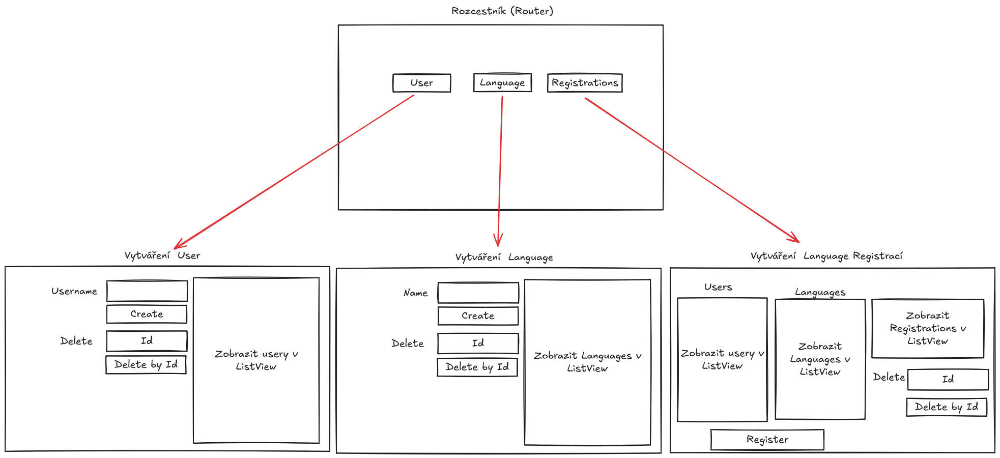

# Simple Duolingo

Odevzdání: **11.3.2025 23:59:59**

- Chci aplikaci ve Winforms s použití .NET a C#
- Uživatel si bude moci na úvodní obrazovce zvolit jednu ze tří možností:
    - User
    - Language
    - Registrations
- Když klikne uživatel na jedno z tlačítek zobrazí se další view s danými možnostmi.
- User a Language jsou jednoduché (inspirujte se moji implementací v solution DatabaseConnection), budou obsahovat pouze vytváření za pomocí name a mazání za pomocí ID.
- Registrations budou obsahovat 2 listView, kde uživatel klikne na jedný z možných Users a Languages, a tyto 2 zvolené položky se budou moci registrovat do tabulky `user_language_registration` (Můžete také přidat 2 textBoxy pro id uživatele a Language pro registraci na místo zvolení z ListView)
- Registrations taky budou obsahoat lisView s již vytvořenými registracemi, kde uživatel bude moci smazat danou registraci pomocí ID
- Když smažete uživatele nebo Language, tak se smaže i přidělené registrace (Cascade Foreign key constraints)
- Při vytvoření nebo smazání záznamu, se listView aktualizuje a zobrazí se aktuální data v databázi

### Hodnocení

- Max: 200 bodů
- Neodevzdání: -50 bodů

#### Specifikace

- Za User View: 40 bodů
- Za Language View: 40 bodů
- Za Registrace View: 40 bodů
- Za error hlášky: 40 bodů
- Za zobrazování všeho v jednom okně: 40 (Bude tam tlačítko back)